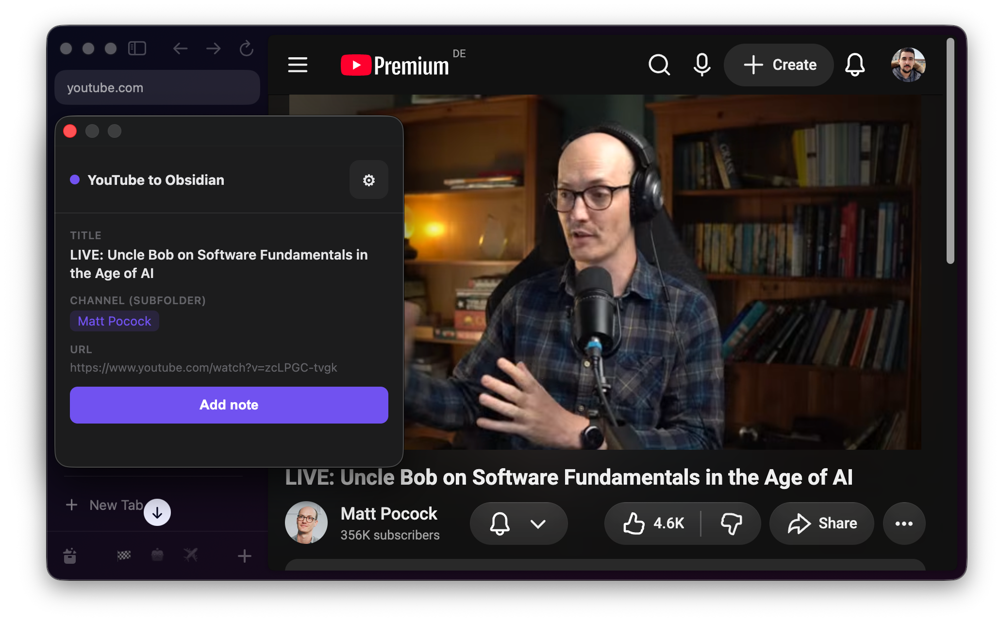

# YouTube to Obsidian

A Chrome extension that saves a YouTube video as a note in your Obsidian vault.
Open the extension popup on any YouTube video, preview the note, and click
**Add note** to create it in your vault.

The extension talks to Obsidian through the [Local REST API](https://github.com/coddingtonbear/obsidian-local-rest-api)
plugin, and creates notes from a template you control.

## Features

- One click to save the current YouTube video as a note.
- Fetches the video title and channel automatically (via YouTube's oEmbed API).
- Organizes notes as `<talks folder>/<Channel>/<Video Title>.md`.
- Uses your own note template, with the template's `video` frontmatter property
  filled in with the video URL.
- Never overwrites an existing note.
- "Open in Obsidian" link after saving, built from your vault's filesystem path.
- Blocks saving until the vault path, talks folder, and template are configured.

## Screenshots



## Requirements

- A Chromium browser (Chrome, Arc, Edge, Brave, etc.).
- [Obsidian](https://obsidian.md) with the
  [Local REST API](https://github.com/coddingtonbear/obsidian-local-rest-api)
  community plugin installed and enabled.

## Installation

### 1. Set up Obsidian

1. In Obsidian, open **Settings -> Community plugins -> Browse**.
2. Search for **"Local REST API"** and install and enable it.
3. Open its settings and enable **"Enable non-encrypted (HTTP) server"**.
   By default it listens on `http://127.0.0.1:27123`.
4. Copy the **API key** shown in the plugin settings.

> The plain HTTP endpoint is used because the HTTPS endpoint uses a self-signed
> certificate, which Chrome's `fetch` rejects. Keep the server bound to
> `127.0.0.1` and never expose it to the internet.

### 2. Load the extension

1. Open `chrome://extensions` (or `arc://extensions`, `edge://extensions`, etc.).
2. Enable **Developer mode** (toggle in the top right).
3. Click **Load unpacked** and select this folder.

### 3. Configure

1. Click the extension's gear icon in the popup, or open its **Options** page
   from the extensions list.
2. Paste the **API key**.
3. Confirm the **Server URL** (`http://127.0.0.1:27123`).
4. Enter the **Vault path**: the full filesystem path to your vault, e.g.
   `/Users/you/Documents/Obsidian`. This is used to build the "Open in Obsidian"
   link.
5. Enter the **Talks folder**: a folder inside your vault where notes go,
   e.g. `2-talks`. It must already exist in the vault.
6. Enter the **Template** path: a note inside your vault whose frontmatter has
   a `video` property, e.g. `Templates/Talk Template.md`.
7. Click **Test connection**, then **Save**.

The API key is stored locally in `chrome.storage.local` and is never committed
to this repository.

## Template

Create a note in your vault to use as a template. It needs a `video` property
in its frontmatter; the extension fills it with the video URL when it creates a
note. Everything else in the template is copied as-is.

```markdown
---
tags:
  - talk
video:
done: false
---

## Notes
```

## Usage

1. Open any YouTube video (`youtube.com/watch?v=...`).
2. Click the extension icon.
3. Review the preview (title, channel, URL).
4. Click **Add note**.

The note is created as `<talks folder>/<Channel Name>/<Video Title>.md`. If it
already exists, it is not overwritten. After saving, an "Open in Obsidian" link
lets you jump straight to the note.

## Privacy

- The only network requests the extension makes are to YouTube's oEmbed API
  (to fetch video metadata) and to your local Obsidian REST API
  (`127.0.0.1`).
- Your API key, vault path, and template are stored in your browser's local
  extension storage and never leave your machine.
- No analytics, no tracking, no third-party services.

## Project structure

```
manifest.json     Extension manifest (Manifest V3)
background.js     Service worker: oEmbed fetch + Local REST API calls
popup.html/js     Toolbar popup: preview + "Add note" button
options.html/js   Settings page (API key, server URL, vault path, template)
icons/            Extension icons
```

## License

[MIT](LICENSE)
